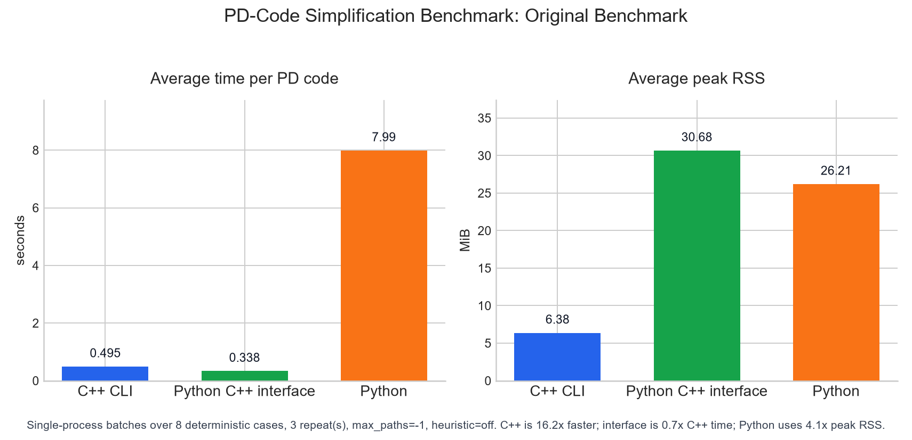
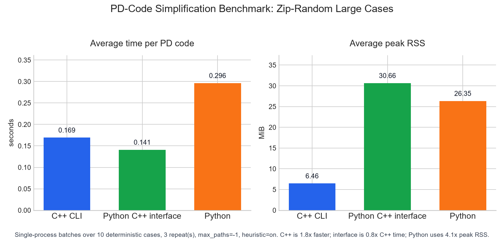
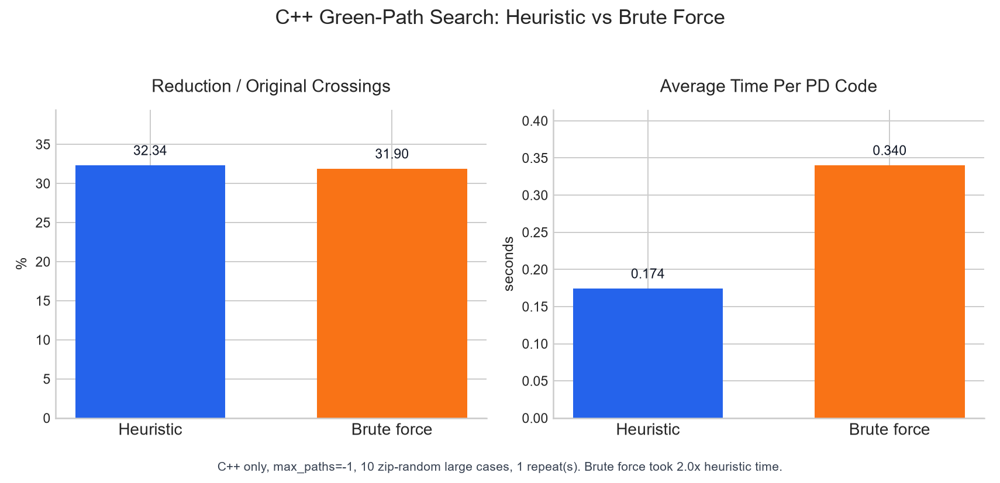

# Benchmarking

The benchmark harness compares the C++ executable, the refactored Python
prototype, and the source-embedded Python C++ interface on the same PD-code
inputs. It records wall-clock time and peak RSS for each process, then
produces CSV, JSON, and a matplotlib-style bar chart.

## Dataset

Public knot tables such as [KnotInfo](https://knotinfo.org/) and
[The Knot Atlas](https://katlas.org/wiki/Main_Page) are useful references for
PD notation and standard knot families. The default repository benchmark does
not download those full tables: the complete external data is larger than this
project needs, and network-dependent benchmarks are hard to reproduce. Instead,
`tools/benchmark_dataset.py` defines a deterministic, lightweight dataset with
standard seed diagrams, generated variants, and ten random corpus samples.

| Case | Family | Crossings | Why It Is Included |
| --- | --- | ---: | --- |
| `3_1_trefoil` | prime seed | 3 | Smallest nontrivial knot seed. |
| `4_1_figure_eight` | prime seed | 4 | Small alternating prime knot with different structure from the trefoil. |
| `5_1_torus` | torus family | 5 | Compact `T(2, 5)` torus-knot seed. |
| `7_1_torus` | torus family | 7 | Medium member of the same scalable family. |
| `9_1_torus` | torus family | 9 | Larger torus-family input with more red/green path work. |
| `trefoil_r1x12` | inflated | 15 | Trefoil after twelve deterministic reverse Reidemeister-I moves. |
| `figure_eight_r1x12` | inflated | 16 | Figure-eight knot after twelve deterministic reverse Reidemeister-I moves. |
| `reference_31` | reference hard case | 31 | Historical hard input bundled with the project. |

The inflated cases preserve the underlying knot type because each added
crossing is introduced by a reverse type-I Reidemeister move. The fixed seeds
make the generated PD codes stable across platforms.

The ten `zip_random_*` cases are sampled from the local
`tests/pd_code.zip` corpus supplied during development. The zip itself is
ignored and is not committed. The committed fixture
`tests/benchmark_random_pd_codes.txt` stores the sampled PD codes so the
benchmark remains reproducible without the original archive. The sample uses
seed `20260708` and source files with at most 150 crossings; the resulting
cases span 120 to 150 crossings.

## Running

Install development dependencies:

```sh
python -m venv .venv
.\.venv\Scripts\python -m pip install -r requirements-dev.txt
```

Build the C++ executable, then run:

```sh
python tools/package.py build
```

```sh
.\.venv\Scripts\python tools\benchmark_cpp_python.py ^
  --suite original ^
  --repeat 3 ^
  --max-paths -1 ^
  --ban-heuristic ^
  --interface-cxx C:\path\to\g++.exe ^
  --plot docs\assets\benchmark_original_cpp_python.png ^
  --summary-csv docs\assets\benchmark_original_summary.csv ^
  --raw-csv docs\assets\benchmark_original_raw.csv ^
  --json docs\assets\benchmark_original_results.json
```

Run the zip-random large-case suite separately:

```sh
.\.venv\Scripts\python tools\benchmark_cpp_python.py ^
  --suite random ^
  --repeat 3 ^
  --max-paths -1 ^
  --interface-cxx C:\path\to\g++.exe ^
  --plot docs\assets\benchmark_random_cpp_python.png ^
  --summary-csv docs\assets\benchmark_random_summary.csv ^
  --raw-csv docs\assets\benchmark_random_raw.csv ^
  --json docs\assets\benchmark_random_results.json
```

On Linux and macOS, use `.venv/bin/python` and shell line continuations with
`\` instead of `^`.

The Python C++ interface compiles and caches a dynamic library through
`cpp-simple-interface`. That cache is warmed before measurements begin, so the
chart reports normal cached `ctypes` calls rather than first-use compilation
time.

The original lightweight suite is run with `--max-paths -1 --ban-heuristic`,
which means complete green-path enumeration after preprocessing. The large
zip-random suite is run with `--max-paths -1`, which means deterministic
heuristic green-path sampling.

Each measurement repeat writes the selected cases to one temporary multi-line
PD-code file, then starts each engine once to process the whole file. The chart
reports average time per PD code and peak RSS for the whole batch.

All three engines run the same default preprocessing pipeline before the
mid-simplification search: R1-move removal followed by nugatory-crossing
removal. The Python prototype implements this preprocessing in Python, while
the Python C++ interface reuses the C++ dynamic library.

The C++ heuristic-vs-brute-force comparison is separate from the three-engine
benchmark and runs only on the ten zip-random large cases:

```sh
.\.venv\Scripts\python tools\benchmark_cpp_heuristic.py ^
  --repeat 1 ^
  --plot docs\assets\heuristic_vs_bruteforce_random.png ^
  --summary-csv docs\assets\heuristic_vs_bruteforce_random_summary.csv ^
  --raw-csv docs\assets\heuristic_vs_bruteforce_random_raw.csv ^
  --json docs\assets\heuristic_vs_bruteforce_random_results.json
```

The reduction metric for that chart is the observed preprocessing reduction
plus the first witness's red-green path length difference, divided by the
original crossing count. The CLI currently reports a witness instead of
rewriting the diagram by that witness, so this is a one-step reduction
potential metric.

## Local Results

The committed charts were generated on the local Windows development machine
with a MinGW `g++ -O3 -DNDEBUG` C++ executable. The original lightweight suite
uses `max_paths=-1` with heuristic disabled; the zip-random suite uses
`max_paths=-1` with heuristic enabled. Each three-engine suite uses three
repeats.

Original lightweight suite:



| Engine | Average Time Per PD Code (s) | Average Peak RSS (MiB) |
| --- | ---: | ---: |
| C++ CLI | 0.494679 | 6.383 |
| Python C++ interface | 0.338129 | 30.682 |
| Python | 7.990471 | 26.214 |

Zip-random large-case suite:



| Engine | Average Time Per PD Code (s) | Average Peak RSS (MiB) |
| --- | ---: | ---: |
| C++ CLI | 0.169238 | 6.465 |
| Python C++ interface | 0.141012 | 30.659 |
| Python | 0.296344 | 26.352 |

Summary CSV files are stored in
[`docs/assets/benchmark_original_summary.csv`](assets/benchmark_original_summary.csv)
and [`docs/assets/benchmark_random_summary.csv`](assets/benchmark_random_summary.csv).
Raw measurements are stored in the matching `*_raw.csv` files.

C++ heuristic-vs-brute-force comparison on the zip-random large-case suite:



| Mode | Average Time Per PD Code (s) | Reduction / Original Crossings (%) |
| --- | ---: | ---: |
| Heuristic | 0.174462 | 32.338 |
| Brute force | 0.340326 | 31.901 |

The summary CSV is stored in
[`docs/assets/heuristic_vs_bruteforce_random_summary.csv`](assets/heuristic_vs_bruteforce_random_summary.csv).
